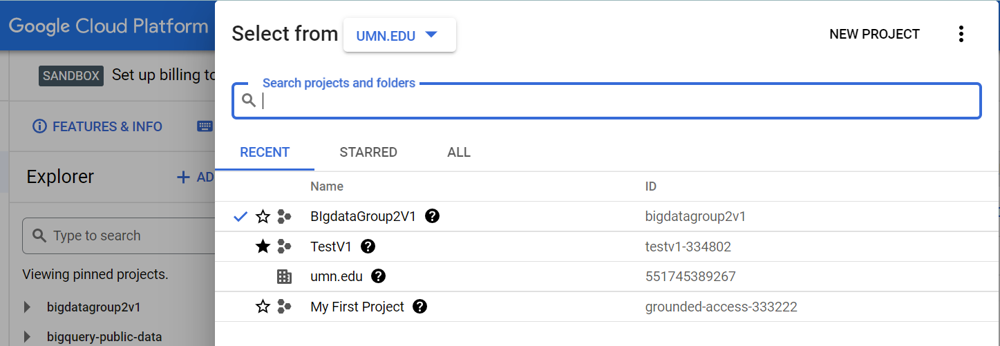
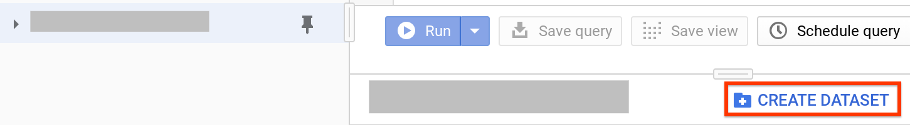
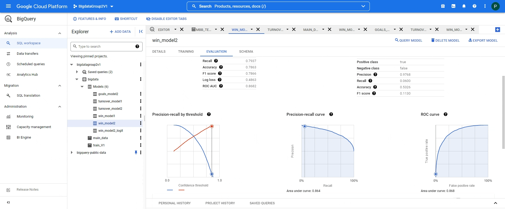
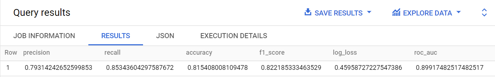

Machine Learning Using BigQueryML


<div id="top"></div>
<!-- TABLE OF CONTENTS -->
<details>
  <summary>Table of Contents</summary>
  <ol>
    <li>
      <a href="#about-the-project">About The Project</a>
    </li>
    <li>
      <a href="#getting-started">Getting Started</a>
      <ul>
        <li><a href="#prerequisites">Prerequisites</a></li>
        <li><a href="#installation">Installation</a></li>
      </ul>
    </li>
    <li><a href="#usage">Usage</a></li>
    <li><a href="#roadmap">Roadmap</a></li>
    <li><a href="#contributing">Contributing</a></li>
    <li><a href="#license">License</a></li>
    <li><a href="#resources">Resources</a></li>
    <li><a href="#contributers">Contributers</a></li>
  </ol>
</details>


<!-- ABOUT THE PROJECT -->
## About The Project

[Big Query ML](https://cloud.google.com/bigquery-ml/docs)

The data science world as we know it is obsessed with building the most innovative and effective ML models. Machine learning on large datasets requires extensive programming and knowledge of ML frameworks. These requirements restrict solution development to a very small set of people.Many companies couldn’t afford data scientists with such a level of expertise but have a need to build models to drive their business forward. 

BigQuery ML democratizes machine learning by letting SQL practitioners build models using existing SQL tools and skills.Companies can use their data analysts who understand the data but have limited knowledge and programming expertise.

Our project will walk you through the project on how to use this amazing tool using a sample NCAA Basketball dataset.


<p align="right">(<a href="#top">back to top</a>)</p>

<!-- GETTING STARTED -->
## Getting Started

This is an example of how you may give instructions on setting up your project locally.
To get a local copy up and running follow these simple example steps.

### Prerequisites

A working knowledge of database querying skills.

### Installation

To get started with BigQueryML 

1. Create a free trial account with Google Cloud:- [Create Account](https://console.cloud.google.com/freetrial?_ga=2.204501072.151589388.1651269401-1400319142.1646283033)

2. In the google console page:- [Create a Project](https://cloud.google.com/resource-manager/docs/creating-managing-projects)
3. [Make sure billing is enabled.](https://cloud.google.com/billing/docs/how-to/verify-billing-enabled)

4. [Ensure that the API is enabled.](https://console.cloud.google.com/flows/enableapi?apiid=bigquery&_ga=2.3380720.151589388.1651269401-1400319142.1646283033)

<p align="right">(<a href="#top">back to top</a>)</p>


<!-- USAGE EXAMPLES -->
## Usage

##### Navigate to the BigQuery Console. Check the access of your account to the console [here](https://console.cloud.google.com/bigquery?)

### Step one: Create a Project
Start with creating a project in the GCP Sandbox. 
1. In the navigation panel, there is an option to create a project right next to "Google Cloud Platform".
2. Start with a new project.

All the steps going forward- the data, models and results will be stored at one place in this project.

### Step two: Create your dataset
The second step is to create a BigQuery dataset to store your model. To create your dataset, follow these steps:
1. In the Cloud Console, go to the BigQuery page.
     Go to the BigQuery page
1. In the navigation panel, in the Resources section, click your project name.
1. On the right side, in the details panel, click 
1. On the Create dataset page, for Dataset ID, enter census.
1. Leave all of the other default settings in place and click Create dataset.

### Step Three:
Creating Tables.
Add the data that you want to work on to the database created in step2.
   ```sh
CREATE TABLE IF NOT EXISTS  `big-data-bas.bigdata.main_data`
AS 
SELECT
  Game_id, field_goals_made, 
  turnovers, offensive_rebounds, 
  defensive_rebounds, free_throws_made, 
  assists, blocks, steals ,win,
   CASE
    WHEN row_num <= 20862  THEN 'training'
    WHEN row_num <= 26822  THEN 'evaluation'
    ELSE 'prediction'
   END AS dataframe
  
FROM
(
  SELECT 
    Game_id, field_goals_made, 
    turnovers, offensive_rebounds, 
    defensive_rebounds, free_throws_made, 
    assists, blocks, steals ,win, ROW_NUMBER() OVER (partition by win) as row_num
  
  FROM `bigquery-public-data.ncaa_basketball.mbb_teams_games_sr`
  WHERE win is NOT NULL AND
    turnovers  IS NOT NULL AND
    offensive_rebounds IS NOT NULL AND 
    defensive_rebounds  IS NOT NULL AND
    free_throws_made IS NOT NULL AND
    assists  IS NOT NULL AND
    blocks  IS NOT NULL AND
    steals  IS NOT NULL AND
    field_goals_made IS NOT NULL 
);
   ```

### Step Four:
Create a Model.
   ```sh
# Model
CREATE MODEL IF NOT EXISTS 'big-data-bas.bigdata.win_model1`
OPTIONS 
  (MODEL_TYPE = 'BOOSTED_TREE_CLASSIFIER', 
  learn_rate = 0.1,
  early_stop = TRUE,
  input_label_cols=['win']) AS
SELECT 
  field_goals_made, 
  turnovers, offensive_rebounds, 
  defensive_rebounds, free_throws_made, 
  assists, blocks, steals ,win
FROM `big-data-bas.bigdata.train_V1`
WHERE win is NOT NULL;
```

You can check the performance of your classifier at different score thresholds and choose an appropriate thereshold as per your business problem.

### Step Five:
Evaluation of the Model's predictions:
``` sh
# Evaluate the model
SELECT
  *
FROM
  ML.EVALUATE (MODEL `big-data-bas.bigdata.win_model1`,
    (
    SELECT
      *
    FROM
      `big-data-bas.bigdata.main_data`
    WHERE
      dataframe = 'evaluation'
    )
  )
  ;
```


<p align="right">(<a href="#top">back to top</a>)</p>
Here's out of sample preformance of our model with probability threshold of 0.5.


<!-- LICENSE -->
## License

_This project repository is created in partial fulfillment of the requirements for the Big Data Analytics course offered by the Master of Science in Business Analytics program at the Carlson School of Management, University of Minnesota._

<p align="right">(<a href="#top">back to top</a>)</p>


<!-- ACKNOWLEDGMENTS -->
## Resources used

These are some useful resources to get started with Bigquery ML.

* [Google Cloud end-to-end user journey for each model](https://cloud.google.com/bigquery-ml/docs/reference/standard-sql/bigqueryml-syntax-e2e-journey)
* [NCAA Basketball dataset](https://console.cloud.google.com/marketplace/product/ncaa-bb-public/ncaa-basketball?q=search&referrer=search&project=bigdatagroup2v1)
* [BigQuery Cheat Sheet](https://medium.com/geekculture/my-bigquery-query-cheat-sheet-dd8bc7b5a69b) 
* [Velotio's BigQuery 101: All the Basics You Need to Know](https://medium.com/velotio-perspectives/bigquery-101-all-the-basics-you-need-to-know-f298ac20268)

<p align="right">(<a href="#top">back to top</a>)</p>


<!-- CONTACT -->
## Contributers

* Bailey Hill - [@LinkedIn](https://www.linkedin.com/in/bailey-hill-10/) - hill2051@umn.edu 
* Kiran - [@LinkedIn](https://www.linkedin.com/in/phaniharam-kiran/) - phani003@umn.edu
* Priyanka Bhosale - [@LinkedIn](https://www.linkedin.com/in/bhosalepriyanka/) - bhosa010@umn.edu
* Qujiaheng (Johnny) Zhang - [@LinkedIn](https://www.linkedin.com/in/qujiahengzhang/) - zhan7977@umn.edu 
* Rahul Agarwal - [@LinkedIn](https://www.linkedin.com/in/rahula29/) - agarw276@umn.edu

Project Link: [https://github.com/bvfst/BigQueryML](https://github.com/bvfst/BigQueryML)

<p align="right">(<a href="#top">back to top</a>)</p>


<!-- MARKDOWN LINKS & IMAGES -->
<!-- https://www.markdownguide.org/basic-syntax/#reference-style-links -->
[contributors-shield]: https://img.shields.io/github/contributors/othneildrew/Best-README-Template.svg?style=for-the-badge
[contributors-url]: https://github.com/othneildrew/Best-README-Template/graphs/contributors
[forks-shield]: https://img.shields.io/github/forks/othneildrew/Best-README-Template.svg?style=for-the-badge
[forks-url]: https://github.com/othneildrew/Best-README-Template/network/members
[stars-shield]: https://img.shields.io/github/stars/othneildrew/Best-README-Template.svg?style=for-the-badge
[stars-url]: https://github.com/othneildrew/Best-README-Template/stargazers
[issues-shield]: https://img.shields.io/github/issues/othneildrew/Best-README-Template.svg?style=for-the-badge
[issues-url]: https://github.com/othneildrew/Best-README-Template/issues
[license-shield]: https://img.shields.io/github/license/othneildrew/Best-README-Template.svg?style=for-the-badge
[license-url]: https://github.com/othneildrew/Best-README-Template/blob/master/LICENSE.txt
[linkedin-shield]: https://img.shields.io/badge/-LinkedIn-black.svg?style=for-the-badge&logo=linkedin&colorB=555
[linkedin-url]: https://linkedin.com/in/othneildrew
[product-screenshot]: images/screenshot.png
